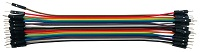
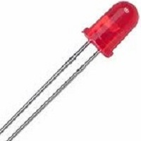
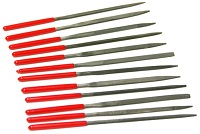
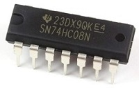

Hare are the materials listed that were used in the construction of _'LED Combination Box'_:
    
- Wires (A Lot)

- 4 input Switch

- Buttons

- LED's

- Tiny Filing Tool

- A Small box (of any kind since it doesn't affect putting it and it isn't too small)

- Small Breadboard's (Around 2 to 3)

- Chips (Not the food kind, but the logic kind)
          
   - Quad And Gate (74HC08)
   
          
   - Quad Exclusive Or Gate --> 'XOR Gate' (74HC86)
   
          
   - Quad Nand Gate (74HC00)
   
          
   - Dual J-K Flip Flop (74HC73) --> 'Note' : I might be hard to find this gate and it might have a similar Gate 
   
