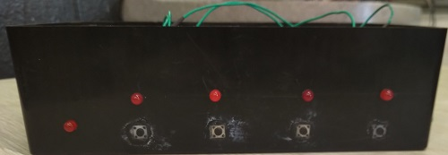

# Conclusion

During My Midterm Project, I learned that not all things can be simplified and don't try to do it from the beginning, Tinkercad is just a simulation of what can happen but won't tell you if something is missing in the real life and you have to decode what is happening, not everything you need to do can be done alone an sometimes you will need help, and last but not least do not try to relax until the project is officially done and you have submitted it.

During the creation of the Github website, I learned what the _'push', 'add', ' git', 'commit',_ and _'status'_ commands do and how they are important to updating the website from local to Github, I learned about how Github works and how Github simplifies HTML so it is easier to create website, and also learned that the local and Github is called _'markdown'_ and HTML is called _'markup'_.

The midterm project along with the creation was a fun, grooling, annoying, and intense experience altogether. I pushed through many problems, and in the end got the end result I wanted. I am happy with what I have created, and hopefully this website is useful to any who come across it.

