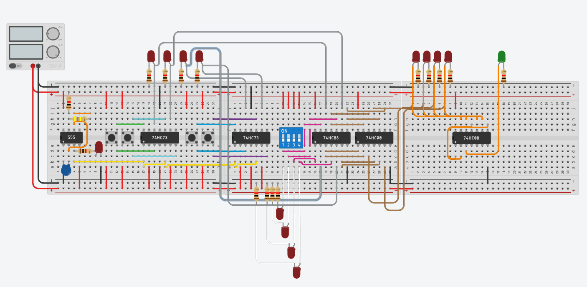

# Instructions

Here are the steps used to create the bluprints, contruct the _'LED Combination Box'_:
        
1. Go to Tinkercad (Make an account if you don't have one, you can also click on the button in the upper right corner area to go to tinkercad) and start a new project for Circuits --> Here is the link: "tinkercad.com"

1. Start making the circuit as shown below:

1. Make a Truth Table and make sure it fits the logic in the circuit on Tinkercad. (You might have to go through multiple trial and errors to find the most optimal Truth Table)

1. Follow the blueprint you made on Tinkercad (Make sure the logic works in real life because Tinkercad is just a simulation and will gave different results than what actually will happen.)

1. After properly checking in Step 4, find the dimensions of the buttons used. After that make small holes for the LED's and for the buttons.( Make sure there are holes for these specific LED's: he button's LED, the clock LED, and the End result LED, and also for the power suply wires. Also, CONTINUE READING) Then take the tiny filing tools and file the hole until the button can fit with minimal space (Make sure to check the hole every time you file to get to the closest exact measurements)

1. Soder wires to the buttons. (Make sure the wires are of appropriate lengeth) Glue the button into the holes.

1. Put everything together and make sure it works.